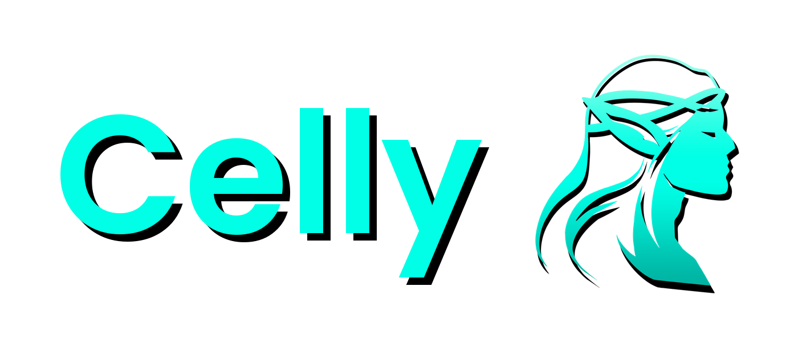

<p align="center">
  
</p>

<p align="center"><strong>Drive OpenCode coding agents from Discord — one isolated microVM per project.</strong></p>

Celly turns [Discord](https://discord.com) into a control surface for
[OpenCode](https://opencode.ai). Each project runs in its own disposable
[`sbx`](https://www.docker.com/products/docker-sandboxes/) (Docker Sandboxes)
microVM on your host, and the agent can only reach that project's directory.
Start a session from your phone, watch it stream, and pick it back up later.

Full documentation: **https://celly.agub.dev**

## Why Celly

- **No terminal required.** Discord on desktop or mobile is the whole UI.
- **Isolation by default.** Every project gets its own microVM, not a shell on
  your host.
- **Nothing to babysit.** Start a session, close the app, and come back to the
  transcript and the running sandbox.
- **Built on OpenCode.** The same sessions are reachable from Discord and from a
  terminal attached to the sandbox.

## How it works

- **Channel = project.** One sandbox and one host directory per Discord channel.
- **Thread = session.** One OpenCode conversation per thread.
- **The bot runs on the sandbox host.** It supervises one
  `sbx exec ... opencode serve` child per project and talks to it over the
  sandbox's loopback port. Only the host can run `sbx`, so Celly is host-only.

## Prerequisites

- A host where `sbx` runs — Windows 11, or macOS/Linux where Docker Sandboxes
  runs. Celly cannot run inside a Linux container.
- [Node 24.x](https://nodejs.org) exactly (pinned by `engines` and `.nvmrc`).
- [Docker Sandboxes](https://www.docker.com/products/docker-sandboxes/) `sbx`
  >= 0.45, installed and logged in.
- A Docker login and an initialized network policy
  (`sbx policy init balanced`).
- A [Discord application](https://discord.com/developers/applications) with a
  bot token, the **Message Content** intent enabled, and one or more guild IDs.
- An OpenCode provider credential registered with `sbx secret`.

## Quick start

1. **Bootstrap the host** (once, as the user who will own the bot):

   ```powershell
   winget install -h Docker.sbx   # Windows; use your platform's install on macOS/Linux
   sbx setup
   sbx login
   sbx policy init balanced
   sbx secret set <provider>
   ```

2. **Install and run:**

   ```powershell
   npx bot-celly@latest
   ```

   The first run asks for your Discord bot token and guild IDs — and optionally a
   GitHub token for the sandboxes — and saves them to `~/.bot-celly/.env`
   (`%USERPROFILE%\.bot-celly\.env` on Windows; override with `CELLY_HOME`). It
   checks the host, then starts the bot. `PROJECTS_ROOT` defaults to
   `~/Celly/projects`.

   `npx bot-celly doctor` checks the host without starting; `npx bot-celly setup`
   reconfigures — or updates a single value without prompts, e.g.
   `npx bot-celly setup --github-token <value>`.

3. **Add a project.** In Discord:

   ```text
   /project add name:my-app path:my-app
   ```

   Then post a plain message in the new `#my-app` channel. Celly opens a thread,
   creates a session, and streams the reply.

The full walkthrough is in the
[Quickstart](https://celly.agub.dev/quickstart); every environment variable is in
[Configuration](https://celly.agub.dev/guides/configuration).

## Commands

The everyday handful:

| Command | What it does |
|---|---|
| `/project add <name> <path>` | Register a directory and spin up its sandbox. |
| `/new [prompt]` | Start a session in the project channel. |
| `/resume` | Reopen a past session in a new thread. |
| `/abort` | Stop the current run, or all runs in the channel. |
| `/model` · `/agent` · `/thinking` | Switch the model, agent, or thinking depth for a thread. |
| `/mode auto\|buttons\|plan` | Choose how approvals are requested. |
| `/cost` | Show accumulated cost, tokens, and the session budget. |
| `/attach` | Show the terminal attach command for this thread's session. |
| `/session-id` | Show this thread's session id and attach command. |

The full command surface, access rules, scheduled tasks, worktrees, and
archived-thread behavior live in the
[commands reference](https://celly.agub.dev/reference/commands).

## Security

- **argv-only `sbx` calls** (`shell: false`) — no shell interpolation.
- **One microVM per project** — the host filesystem outside the mount is
  unreachable by the agent.
- **Contained paths** under `PROJECTS_ROOT`, checked against a sensitive-path
  denylist.
- **Loopback-only server** with a generated password; provider credentials live
  in `sbx secret`, never in argv or Discord.
- **Optional `GITHUB_TOKEN`** is copied into each sandbox over stdin (mode
  `0600`), never on a command line.

The deny list is defense-in-depth; the sandbox is the boundary. Read the
[security reference](https://celly.agub.dev/reference/security) for the full
model.

## Documentation

- [Quickstart](https://celly.agub.dev/quickstart) — bootstrap, install, first project.
- [Commands](https://celly.agub.dev/reference/commands) — the full command surface.
- [Configuration](https://celly.agub.dev/guides/configuration) — every environment variable.
- [Security](https://celly.agub.dev/reference/security) — invariants and the permission policy.
- [Operations](https://celly.agub.dev/guides/operations) — admin page, logs, backups, restore.
- [Architecture](https://celly.agub.dev/reference/architecture) — module map, create saga, boot recovery.
- [Limitations](https://celly.agub.dev/reference/limitations) · [Known issues](https://celly.agub.dev/reference/known-issues) · [Roadmap](https://celly.agub.dev/project/roadmap).

## Development

```powershell
npm run dev          # tsx watch src/index.ts
npm test             # full vitest suite
npm run typecheck    # tsc --noEmit
npm run build        # tsc -p tsconfig.json
```

From a checkout: `npm ci && npm run build`, copy `.env.example` to `.env`, then
`node dist/index.js`. Two host-only scripts exercise the real chain and are not
run by the Linux test suite:

```powershell
node scripts/spike-full-chain.mjs            # sbx + serve + health spike
node scripts/smoke.mjs C:\path\to\project    # create → prompt → abort → remove
```

Docs live in `docs-site/` (`npm run docs:dev`, `npm run docs:validate`,
`npm run docs:links`).

## Contributing

Issues and pull requests are welcome. Before opening a PR, run `npm test`,
`npm run typecheck`, and `npm run build`; keep the **argv-only invariant**; add
tests and a changeset for behavior changes; and update the docs and this README.
This project follows the [Code of Conduct](CODE_OF_CONDUCT.md); report
vulnerabilities via [SECURITY.md](SECURITY.md), not a public issue. See
[Contributing](https://celly.agub.dev/contributing) and `AGENTS.md` for the
definition of done.

## License

MIT. See [LICENSE](LICENSE).

## Credits

- Inspired by [remorses/kimaki](https://github.com/remorses/kimaki) (MIT).
- Built on [Docker Sandboxes](https://www.docker.com/products/docker-sandboxes/)
  (`sbx`) and [OpenCode](https://opencode.ai).
- The full stack and credits are on
  [Tech stack](https://celly.agub.dev/project/tech-stack).

<p align="center">
  <a href="https://github.com/LegendArtur/bot-celly/actions/workflows/ci.yml"></a>
  <a href="LICENSE"></a>
</p>
