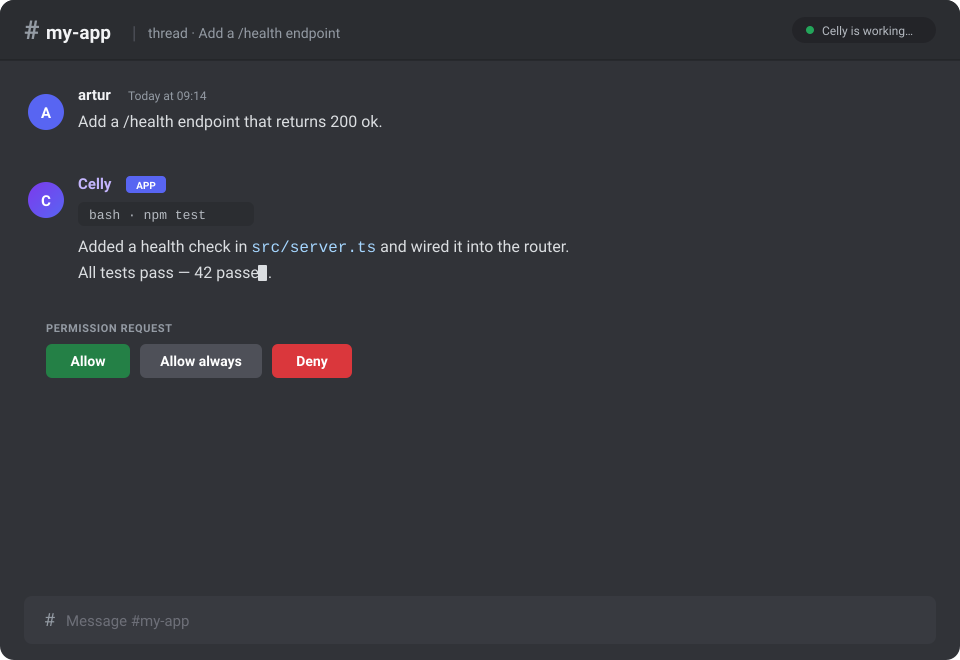

<h1 align="center">Celly</h1>

<p align="center"><strong>A Discord forge for coding agents.</strong></p>

<p align="center">
  
</p>

Start a coding agent from your phone, in a channel you already keep open. Celly
turns [Discord](https://discord.com) into a control surface for
[OpenCode](https://opencode.ai) agents: kick off work, watch it stream, approve a
command, and pick the session back up later.

It is for people who want an always-on coding agent without exposing their whole
machine: each project runs in its own disposable sandbox, and the only thing the
agent can reach is that project's directory. For a deeper tour, see the
[docs](https://celly.agub.dev).

## Why Celly

- **Drive agents from anywhere.** No terminal required — Discord on desktop or
  mobile is the whole UI.
- **Isolation by default.** Every project gets its own microVM, not a shared
  shell on your host.
- **Nothing to babysit.** Start a session, close the app, come back to the
  transcript and the running sandbox.
- **Built on OpenCode.** Use the same sessions from Discord *and* a terminal
  attached to the sandbox.

## How it works

The whole model fits in three lines:

- **Channel = project.** One sandbox and one host directory per Discord channel.
- **Thread = session.** One OpenCode conversation per thread.
- **The bot runs on the sandbox host.** It supervises one
  `sbx exec ... opencode serve` child per project and talks to it over the
  sandbox's loopback port. Only the host can run the `sbx` (Docker Sandboxes)
  CLI, which is why Celly is host-only.

## Contents

- [Why Celly](#why-celly)
- [How it works](#how-it-works)
- [Features](#features)
- [Architecture](#architecture)
- [Prerequisites](#prerequisites)
- [Quick start](#quick-start)
- [Commands](#commands)
- [Security](#security)
- [FAQ and troubleshooting](#faq-and-troubleshooting)
- [Development](#development)
- [Status and roadmap](#status-and-roadmap)
- [Limitations](#limitations)
- [Contributing](#contributing)
- [License](#license)
- [Credits](#credits)

## Features

- **Per-project sandbox isolation.** Every project owns a microVM; the host
  filesystem outside the mounted project directory is unreachable by the agent.
- **Streaming replies.** Assistant text and tool activity stream into the thread,
  throttled into a single live message.
- **Session resume.** `/resume` reopens a past OpenCode session in a new thread.
- **Per-thread worktrees.** `/worktree` creates, merges, and removes git
  worktrees under `<project>/.celly/worktrees`, and `/fork` (or `/btw`) forks a
  session with its worktree.
- **Model and agent switching.** `/model` and `/agent` pick per-thread settings.
- **Abort.** `/abort` stops the current run, or every active run in the channel.
- **Approvals.** `/mode` picks `auto`, `buttons`, or `plan`; `buttons` posts
  permission requests as Discord buttons and agent questions as
  buttons/selects/modals. Decisions are written to a best-effort audit log.
- **Shell.** A message starting with `!` runs `bash -lc <command>` inside the
  project's sandbox.
- **Text attachments.** Size-capped, written to a validated inbox, referenced in
  the prompt.
- **Terminal coexistence.** The same sessions are reachable from `opencode
  attach` inside the sandbox.
- **Access control.** Guild owner, `Manage Guild`/`Administrator`, an access
  role, and a block role.
- **Hardened permission policy.** A bot-enforced deny list blocks publish, push,
  and env-file inspection, and is re-asserted after every wake.
- **Cost tracking and budgets.** `/cost` reports per-thread and per-channel
  usage, and a session budget (env or `/budget`) stops a run that exceeds it.
- **Local admin page.** A loopback-only status page and JSON API on
  `127.0.0.1:4560` (`ADMIN_PORT`, `0` disables) for projects, health,
  start/stop, logs, and audit — localhost only and unauthenticated by design.

## Architecture

```
Discord (channel = project, thread = session)
                                   │
                                   ▼
┌──────────────────── host (Node 24, Windows 11) ─────────────────────┐
│  Celly bot                                                          │
│    • gateway + slash commands                                       │
│    • Runner + Renderer: run state and streaming edits               │
│    • EventRouter: SSE /global/event -> thread routing               │
│    • ProjectService: create / wake / stop one sbx per project       │
│    • SQLite: projects, threads                                      │
│                                                                     │
│  127.0.0.1:HOSTPORT   (Basic auth)                                  │
└──────────────────────────────────┬──────────────────────────────────┘
                                   ▼
                         ┌───────────────────┐
                         │  sbx microVM      │   one per project
                         │   opencode serve  │   sandbox port 4096
                         │   mounted project │
                         └───────────────────┘
```

See the [architecture reference](https://celly.agub.dev/reference/architecture)
for the module map, create saga, and boot recovery.

## Prerequisites

Gather these before you start — the setup steps assume they are ready.

- [ ] **A host where `sbx` runs.** Windows 11 for v1, or macOS/Linux where
      Docker Sandboxes runs. The bot cannot run inside a Linux container: only
      the host can execute `sbx`.
- [ ] **[Node 24.x](https://nodejs.org)** exactly (pinned by `engines` and
      `.nvmrc`).
- [ ] **[Docker Sandboxes](https://www.docker.com/products/docker-sandboxes/)
      `sbx` >= 0.45**, installed and logged in.
- [ ] **A Docker login** and an initialized network policy
      (`sbx policy init balanced`).
- [ ] **A [Discord application](https://discord.com/developers/applications)**
      with a bot token, the **Message Content** intent enabled, and one or more
      guild IDs.
- [ ] **An OpenCode provider configured** through `sbx secret`.

## Quick start

1. **Bootstrap the host** (once, interactive, as the logged-in user):

   ```powershell
   winget install -h Docker.sbx
   sbx setup
   sbx login
   sbx policy init balanced
   sbx secret set <provider>
   ```

2. **Install and configure:**

   ```powershell
   git clone https://github.com/LegendArtur/bot-celly.git
   cd bot-celly
   npm ci
   npm run build
   copy .env.example .env    # macOS/Linux: cp .env.example .env
   ```

   Set **only** `DISCORD_TOKEN` and the guild list in `DISCORD_GUILD_IDS`
   (comma-separated; `DISCORD_GUILD_ID` still works for one guild).
   `PROJECTS_ROOT` defaults to `~/Celly/projects`.

3. **Run** `node dist/index.js`, then `/project add name:<name> path:<path>` and
   send a message in the new channel.

> **You'll know it worked when:** the bot comes online, your `/project add`
> command creates a channel under the **Forge** category, and a plain message in
> that channel opens a thread and streams the agent's reply.

The full walkthrough is in the
[Quickstart](https://celly.agub.dev/quickstart). Every environment variable
is documented in
[Configuration](https://celly.agub.dev/guides/configuration).

## Commands

The everyday handful:

| Command | What it does |
|---|---|
| `/project add <name> <path>` | Register a directory and spin up its sandbox. |
| `/new [prompt]` | Start a session in the project channel. |
| `/resume` | Reopen a past session in a new thread. |
| `/abort` | Stop the current run, or all runs in the channel. |
| `/model` · `/agent` | Switch the model or agent for a thread. |
| `/mode auto\|buttons\|plan` | Choose how approvals are requested. |
| `/cost` | Show accumulated cost, tokens, and the session budget. |

<details>
<summary>All commands</summary>

| Command | Where | Description |
|---|---|---|
| `/project add <name> <path>` | guild (owner) | Register a directory under `PROJECTS_ROOT`. |
| `/project create <name> [clone] [branch]` | guild (owner) | Create a project directory; optionally `git clone` an https repository. |
| `/project list` | guild | List projects with status and health. |
| `/project status <name>` | guild | Status, port, and session count. |
| `/project start <name>` | guild (owner) | Wake the sandbox (recreates it if missing). |
| `/project stop <name>` | guild (owner) | Stop the sandbox. |
| `/project restart <name>` | guild (owner) | Restart the supervised server without stopping the sandbox. |
| `/project remove <name> <confirm>` | guild (owner) | Remove the sandbox, project, and channel. |
| `/new [prompt]` | project channel | Start a new session. |
| `/resume` | project channel | Resume a past session in a new thread. |
| `/abort` | channel or thread | Abort the current run (or all runs). |
| `/model` | thread or project channel | Choose the model for this thread or the channel default. |
| `/agent` | thread or project channel | Choose the agent for this thread or the channel default. |
| `/attach` | thread | Show the terminal attach command for this thread. |
| `/session-id` | thread | Show this thread's session id and attach command. |
| `/queue` | thread | Show and manage queued prompts for this thread. |
| `/undo` | thread | Revert the session to its last user message. |
| `/redo` | thread | Restore messages reverted by `/undo`. |
| `/diff` | thread | List changed files with `+adds/-dels` and totals. |
| `/share` | thread | Share the session and post the URL. |
| `/unshare` | thread | Stop sharing the session. |
| `/compact` | thread | Summarize the session with the thread's model. |
| `/context-usage` | thread | Token use against the model's context limit. |
| `/worktree status\|new\|merge\|remove` | thread | Manage this thread's git worktree. |
| `/fork [prompt]` / `/btw <prompt>` | thread | Fork this session into a new thread. |
| `/last-sessions [count]` | channel or thread | List recent threads (ephemeral, max 10). |
| `/cost` | thread or channel | Show accumulated cost, tokens, and the session budget. |
| `/budget show\|set <usd>` | channel (owner) | Show or set the per-channel session budget. |
| `/mode <auto\|buttons\|plan>` | project channel or thread (owner) | Set the channel approval mode. |
| `/task add <channel> <prompt> <every_minutes>` | guild (owner) | Schedule a recurring prompt in a project channel. |
| `/task list` | guild | List scheduled tasks. |
| `/task remove <id>` | guild (owner) | Remove a scheduled task. |
| `!<command>` | channel or thread | Run a shell command in the sandbox. |

</details>

Full details and the deferred list are in the
[commands reference](https://celly.agub.dev/reference/commands).

## Security

At a glance:

- **argv-only `sbx` calls** (`shell: false`) — no shell interpolation.
- **One microVM per project** — the host filesystem outside the mount is
  unreachable by the agent.
- **Contained paths** under `PROJECTS_ROOT`, checked against a sensitive-path
  denylist.
- **Loopback-only server** with a generated password; provider credentials live
  in `sbx secret` and never touch argv or Discord.

<details>
<summary>Full security model</summary>

The deny list is defense-in-depth, not a hard boundary — the sandbox is. Read
the [security reference](https://celly.agub.dev/reference/security) for the
full model.

</details>

## FAQ and troubleshooting

**The bot is online but ignores plain messages.**
Enable the **Message Content** intent in the Discord Developer Portal, then
restart the bot.

**`sbx: command not found`, or the bot exits during preflight.**
Celly must run on the host that owns `sbx` (Windows 11 for v1), not inside a
Linux container. Install and log in first (see [Prerequisites](#prerequisites)).

**Startup complains the network policy is missing.**
Run `sbx policy init balanced`.

**The agent fails with a provider or auth error.**
Register the provider with `sbx secret set <provider>` on the host and confirm
you are logged in with `sbx login`.

**A project shows unhealthy, or the serve child will not start.**
Check `data/bot.log`, then run `/project start <name>` (or
`/project restart <name>`).

**Role configuration is rejected.**
Use role **IDs**, not role names.

**Where do I look when something is off?**
The loopback-only admin page on `127.0.0.1:4560` (projects, health, logs,
audit) and `data/bot.log`.

## Development

```powershell
npm run dev          # tsx watch src/index.ts
npm test             # full vitest suite
npm run typecheck    # tsc --noEmit
npm run build        # tsc -p tsconfig.json
```

Two host-only scripts exercise the real chain and are not run by the Linux test
suite:

```powershell
node scripts/spike-full-chain.mjs            # sbx + serve + health spike
node scripts/smoke.mjs C:\path\to\project    # create → prompt → abort → remove
```

Docs live in `docs-site/` (`npm run docs:dev`, `npm run docs:validate`,
`npm run docs:links`).

## Status and roadmap

v1 is the command set above. Deferred to v1.1:

- **Input:** voice messages and image attachments.
- **Surfaces:** OpenCode web UI, diff viewer, tunnels/screenshare, forum-channel
  layout.
- **Scale/deploy:** cloud sandboxes.

## Limitations

- **The message queue is lost on restart.** Queued-but-unsent prompts are
  dropped; active runs re-attach from session history.
- **Role names are not accepted** for role configuration; use role IDs.
- **The finalization footer shows cost and in/out tokens.** Cache reads/writes
  are tracked in `/cost` but not rendered in the footer.
- **Access control is global across guilds.** The same role IDs apply to every
  configured guild; per-guild roles are not supported. A configured guild the bot
  cannot see is skipped at startup with a warning.
- **Per-user command rate limiting, sandbox disk-usage warnings, and `DATA_DIR`
  cloud-sync detection are backlog.** Keep `DATA_DIR` out of synced folders.
- **Host-only items** (the spike, `sbx policy ls` semantics, Windows path
  mapping, live Discord behavior) are exercised on the host, not in the Linux
  test environment.

## Contributing

Issues and pull requests are welcome. Before opening a PR, run `npm test`,
`npm run typecheck`, and `npm run build`. Keep the **argv-only invariant**, add
tests for behavior changes, add a changeset for behavior changes, and never
commit secrets. This project follows the [Code of Conduct](CODE_OF_CONDUCT.md);
report vulnerabilities via [SECURITY.md](SECURITY.md), not a public issue. See
[Contributing](https://celly.agub.dev/contributing) for details.

## License

MIT. See [LICENSE](LICENSE).

## Credits

- Inspired by [remorses/kimaki](https://github.com/remorses/kimaki) (MIT).
- Built on [Docker Sandboxes](https://www.docker.com/products/docker-sandboxes/)
  (`sbx`) and [OpenCode](https://opencode.ai).
