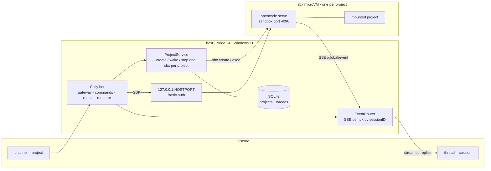

Celly turns [Discord](https://discord.com) into a control surface for
[OpenCode](https://opencode.ai) coding agents. Every project gets its own
isolated `sbx` (Docker Sandboxes) microVM on your host, and you drive it from a
Discord channel and thread: start a session from your phone, watch it work, and
pick it back up later.

The model is small enough to hold in your head:

- **Channel = project.** One `sbx` sandbox and one host directory.
- **Thread = session.** One OpenCode conversation.
- The bot runs **on the `sbx` host**, because only the host can invoke the `sbx`
  CLI. It supervises one long-lived `sbx exec ... opencode serve` child per
  project and talks to it over the sandbox's published loopback port using the
  `@opencode-ai/sdk`.

The name nods to Celebrimbor, the smith who forged the rings of power. Each
project is a forge of its own: its sandbox is `celly-<slug>` and the default
Discord category is **Forge**.

## Topology

Provider credentials are injected by `sbx secret` at the host proxy. They are
never stored in the bot or the repository.

## Start here

<CardGroup cols={2}>
  <Card title="Quickstart" icon="rocket" href="/quickstart">
    Bootstrap the host, install Celly, and run your first prompt in a few
    minutes.
  </Card>
  <Card title="Commands" icon="terminal" href="/reference/commands">
    The full command surface, access rules, and what is deferred.
  </Card>
</CardGroup>

## What you get

- **Per-project sandbox isolation.** Every project owns a microVM; the host
  filesystem outside the mounted project directory is unreachable. See
  [Security](/reference/security).
- **Streaming replies** throttled into a single live message, with fence-aware
  chunking.
- **Approvals.** `auto`, `buttons`, or `plan` per channel, with Discord
  permission buttons and interactive agent questions. See
  [Approvals](/reference/commands#approvals-and-questions).
- **Sessions everywhere.** `/resume`, `/fork`, `/undo`/`/redo`, `/compact`,
  `/diff`, and terminal attach all share one OpenCode session.
- **Per-session git worktrees** under `<project>/.celly/worktrees`, opt-in per
  project or by default with `WORKTREE_DEFAULT`.
- **Cost tracking and budgets** with `/cost` and `/budget`.
- **Multi-guild** deployment and a loopback [admin page](/guides/operations).

Read the [architecture reference](/reference/architecture) for how the create
saga, supervised server, and event router fit together, and the
[security reference](/reference/security) for the enforced invariants. Celly is
inspired by [Kimaki](/project/tech-stack#credits-and-inspiration).
