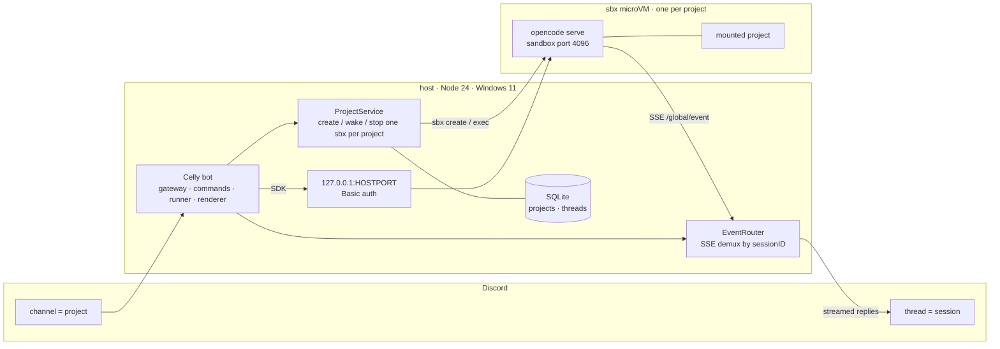

Celly turns [Discord](https://discord.com) into a control surface for
[OpenCode](https://opencode.ai) coding agents. Every project gets its own
isolated `sbx` (Docker Sandboxes) microVM on your host, and you drive it from a
Discord channel and thread: start a session from your phone, watch it work, and
pick it back up later.

The model is small enough to hold in your head:

- **Channel = project.** One `sbx` sandbox and one host directory.
- **Thread = session.** One OpenCode conversation.
- The bot runs **on the `sbx` host** (Windows 11 for v1), because only the host
  can invoke the `sbx` CLI. It supervises one long-lived
  `sbx exec ... opencode serve` child per project and talks to it over the
  sandbox's published loopback port using the `@opencode-ai/sdk`.

The name leans on a forge metaphor. Each project's sandbox is its forge
(`celly-<slug>`), the default Discord category is **Forge**, and the theme is
generic smithing folklore rather than any trademarked name.

## Topology

Provider credentials are injected by `sbx secret` at the host proxy. They are
never stored in the bot or the repository.

**Inspired by [Kimaki](https://github.com/remorses/kimaki)** (MIT): Celly is a
deliberately lightweight re-implementation of its command surface, with `sbx`
sandboxes replacing Kimaki's local process management.

## Start here

<CardGroup cols={2}>
  <Card title="Quickstart" icon="rocket" href="/quickstart">
    Bootstrap the host, install Celly, and run your first prompt in a few
    minutes.
  </Card>
  <Card title="Commands" icon="terminal" href="/reference/commands">
    The full v1 command surface, access rules, and what is deferred.
  </Card>
</CardGroup>

## What you get in v1

- **Per-project sandbox isolation.** Every project owns a microVM; the host
  filesystem outside the mounted project directory is unreachable by the agent.
- **Streaming replies.** Assistant text and tool activity stream into the thread
  and are throttled into a single live message.
- **Session resume.** `/resume` reopens a past OpenCode session in a new thread.
- **Model and agent switching.** `/model` and `/agent` pick per-thread settings.
- **Abort.** `/abort` stops the current run (in a thread) or every active run in
  the project channel.
- **Shell.** A message starting with `!` runs `bash -lc <command>` inside the
  project's sandbox and posts the output.
- **Terminal coexistence.** Sessions are shared between Discord and a terminal
  attached to the same sandbox.

Read the [architecture reference](/reference/architecture) for how the create
saga, supervised server, and event router fit together, and the
[security reference](/reference/security) for the enforced invariants.
