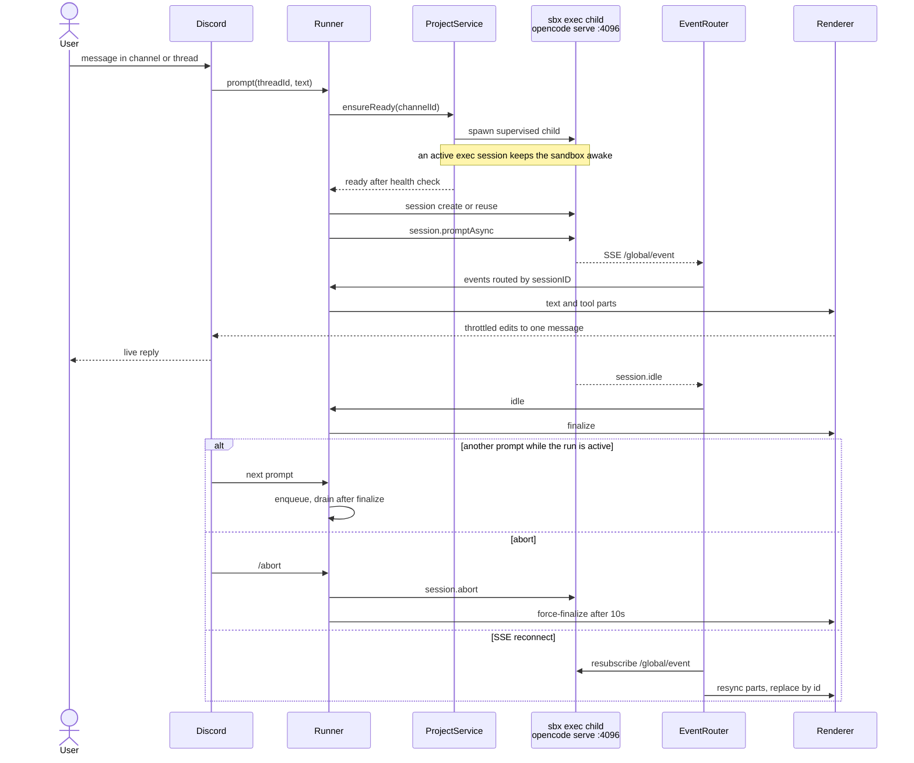

Celly is a Discord bot that runs natively on the `sbx` host. It owns the Discord
surface and the sandbox lifecycle; each project's OpenCode server runs inside
its sandbox and is reached over a loopback-published port.

## Topology



The runtime, libraries, and tooling are listed on
[Tech stack](/project/tech-stack).

## Module map

| Module | Responsibility |
| --- | --- |
| `src/config.ts` | Parse/validate `.env`, expose typed config. Fail fast. |
| `src/log.ts` | Human-readable console logging plus JSONL `data/bot.log`, with redaction of tokens/passwords/headers. Colors only on a TTY (`NO_COLOR`/`FORCE_COLOR` respected). |
| `src/ansi.ts` | Zero-dependency ANSI colors and TTY/`NO_COLOR`/`FORCE_COLOR` detection shared by logs and the startup banner. |
| `src/db.ts` | SQLite schema, `PRAGMA user_version` migrations, `foreign_keys=ON`, typed queries. No business logic. |
| `src/sbx.ts` | **The only module that invokes `sbx`.** argv-only (`spawn(cmd, args, { shell: false })`), typed errors, timeouts, JSON parsers, path/name validation, port allocation, sandbox lifecycle. |
| `src/projects.ts` | Project lifecycle orchestration: create/remove sagas with rollback, `ensureReady()`, per-project single-flight mutex, supervised serve child registry. |
| `src/opencode.ts` | SDK client registry (basic auth), health polling, client factory. |
| `src/events.ts` | `EventRouter`: demultiplexes one project SSE stream by `sessionID` to the owning thread, reconnect/resync, buffer caps. |
| `src/runner.ts` | Per-thread run state machine: session create/reuse, prompt, queue, abort, dispatch to renderer; permission-policy evaluation lives in `src/policy.ts`. |
| `src/policy.ts` | Shell command parsing and permission policy: deny-list matching, wrapper normalization, and the fail-closed indeterminate policy used by `runner.ts`. |
| `src/session-utils.ts` | Session-level SDK calls and formatting: undo/redo (`session.revert`/`unrevert`), diff, share/unshare, compact, context usage. |
| `src/lists.ts` | Session, model, and agent listing (models/agents cached). |
| `src/list-cache.ts` | Generic stale-while-revalidate cache backing the model/agent pickers. |
| `src/render.ts` | Pure event → text/chunk functions plus a throttled editor; fence-aware chunking; parts render in OpenCode's arrival order (text and tool calls interleaved), the run prompt is quoted at the top, and all output goes through one send/edit chokepoint. |
| `src/typing.ts` | Typing-indicator interval manager for active threads. |
| `src/discord.ts` | discord.js client construction, intents/partials, access control. |
| `src/commands.ts` | Slash-command definitions and handlers; delegates to `projects`/`runner`/`sbx`. |
| `src/shell.ts` | `!cmd` handling: calls `sbx.exec()`, owns output chunking only. |
| `src/worktrees.ts` | Per-thread worktrees: slug/branch/porcelain/merge parsing, `.gitignore` maintenance, and argv-only `sbx exec git …` add/list/status/merge/remove operations. |
| `src/index.ts` | Bootstrap: config → db → sbx preflight → single-instance lock → Discord login → command registration → graceful shutdown hooks. |

Invariant: only `src/sbx.ts` spawns processes. `src/shell.ts` and
`src/projects.ts` call its API. A unit test guards this by checking for
`child_process` imports.

## Create saga

`/project add` and `/project create` run a serialized create saga with
compensation at every step (`ProjectService.addProject` in `src/projects.ts`):

1. **Validate the host directory.** `/project add` requires the path to resolve
   inside `PROJECTS_ROOT`; `/project create` creates it under
   `PROJECTS_ROOT/<name>`. The sensitive-path denylist is applied.
2. **Allocate a port and password.** Pick a free host port from the port range,
   generate a 32-hex server password, and insert the `projects` row with
   `status = 'provisioning'`.
3. **`sbx create`.** Create the sandbox (`celly-<slug>`) from the template,
   publishing `<port>:4096` and applying the CPU/memory limits.
4. **Wake check.** `sbx exec <name> true` ensures the sandbox is running before
   any copy.
5. **Bootstrap.** Write the celly-managed OpenCode config and env file inside the
   sandbox over stdin (mode `0600`), so the server password never touches a host
   command line and a project-level `opencode.json` cannot clobber global
   config.
6. **Start and wait.** Start the supervised serve child, read the actual port
   mapping back from `sbx ports --json`, and wait for health within the boot
   timeout.
7. **Enforce the policy.** PATCH the permission policy and assert the running
   server reports it; then mark the project `ready`, resolve its in-sandbox
   path, and create the Discord channel under the **Forge** category.

On failure at any step: kill the child if started, `sbx rm --force <name>`,
release the port, delete the channel/DB row, and report the failing step. A
transient bootstrap failure gets one retry before rollback.

## Supervised server

One long-lived child per project, held in a registry keyed by channel:

```bash
sbx exec <name> bash -lc \
  'set -a; . ~/.config/celly/opencode.env; set +a; exec opencode serve --port 4096 --hostname 0.0.0.0'
```

- Because an exec session is active, the sandbox is not idle-stopped.
- The child's stdout/stderr are captured to `data/logs/<project>.log`.
- Boot is idempotent: if `/global/health` succeeds or a tracked child is alive,
  no second child is started. `ensureReady()` is single-flighted per project.
- If the child exits, the project is marked `degraded`, the channel is notified
  once, and the next prompt or `/project start` re-establishes it.
- A healthy server with no tracked child (an orphan from a previous bot process)
  is adopted rather than duplicated.

## Event router and run state

- One SSE subscription per project reads `/global/event`. `EventRouter`
  demultiplexes frames by `sessionID` to the owning thread, routing to the
  thread that owns the current run (or the most recently active one).
- Resync is **idempotent by part id**: the renderer tracks assistant message and
  part ids and replaces rather than appends, so a reconnect does not duplicate
  output.
- Each thread runs a small state machine (`idle`, `running`, `aborting`,
  `errored`). Prompts are queued (bounded by `MAX_QUEUE`) while a run is active,
  and a global `MAX_CONCURRENT_RUNS` cap bounds concurrency.
- `/abort` moves the run to `aborting`, calls session abort, and force-finalizes
  after a 10-second timer.

## Boot recovery

On boot, before subscribing, each ready project goes through `ensureReady()`
because its sandbox may have stopped and its serve child died with the previous
bot process. Threads left `running` or `aborting` are recovered from session
history and either finalized or re-attached to a new renderer. The in-memory
queue is not restored — see [Limitations](/reference/limitations).

## Related

- [Security](/reference/security) — the invariants behind this design.
- [Commands](/reference/commands) — the user-facing surface.
