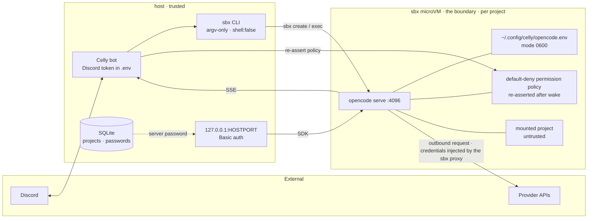

Trust boundary: the sandbox is the boundary. The bot and the host are trusted.
The mounted project directory and everything inside it are untrusted.

Celly favors invariants that are enforced in code and asserted at runtime over
documentation that relies on good behavior.

## Boundary map



## argv-only spawns

<Snippet file="snippets/argv-only.mdx" />

## Per-project microVM

Each project runs in its own `sbx` sandbox with only its project directory
mounted. The host filesystem outside that directory is unreachable by the agent.

## Path containment and denylist

- A project's directory must resolve (realpath, case-insensitive) **inside**
  `PROJECTS_ROOT`. Ancestors and descendants of denied paths are rejected too.
- Text attachments are sanitized (basename only, no `..`, no reserved Windows
  device names, no control characters) and written under `.celly/inbox` with a
  containment check after resolution.
- A single helper owns path logic; call sites do not hand-roll it.

The full denylist is in [Configuration](/guides/configuration).

## Loopback and password

The generated sandbox config enables password auth
(`OPENCODE_SERVER_PASSWORD`), and the server is published only on loopback. The
per-project password is written to `~/.config/celly/opencode.env` (mode `0600`)
inside the sandbox and stored in the bot database. It rotates when a sandbox is
recreated.

## Admin and backup surfaces

- The admin page binds `127.0.0.1:ADMIN_PORT` only and has no authentication
  **by design**: it is safe precisely because it is not network-exposed. The
  consequence is that anything running locally on the host can read status and
  redacted log tails and start or stop projects, so local code shares the host
  trust boundary. It must never be rebound to `0.0.0.0`, published, or
  port-forwarded.
- It exposes project names/status, start/stop actions, and redacted log tails.
  Log redaction reuses the same `redact` path as `bot.log`.
- Backups are written under `DATA_DIR/backups` (`VACUUM INTO` output) and stay
  in the host trust domain, alongside `bot.db`.

See [Operations](/guides/operations) for how to run and reach these surfaces.

## Bot-enforced permission policy

The sandbox config sets a default-deny policy, and the bot re-asserts it at the
API layer after every wake and health check so a project-level `opencode.json`
cannot weaken it. The policy is built by `cellyPolicy()` in `src/opencode.ts`;
the full set is below.

<AccordionGroup>
  <Accordion title="Full permission policy (JSON)">
```json
{
  "$schema": "https://opencode.ai/config.json",
  "share": "disabled",
  "permission": {
    "*": "allow",
    "bash": {
      "*": "allow",
      "git push*": "deny",
      "git clean -fdx*": "deny",
      "npm publish*": "deny",
      "pnpm publish*": "deny",
      "yarn publish*": "deny",
      "printenv*": "deny",
      "env": "deny",
      "cat *opencode.env*": "deny",
      "cat */.config/celly/*": "deny",
      "awk *opencode.env*": "deny",
      "awk */.config/celly/*": "deny",
      "base64 *opencode.env*": "deny",
      "base64 */.config/celly/*": "deny",
      "cp *opencode.env*": "deny",
      "cp */.config/celly/*": "deny",
      "grep *opencode.env*": "deny",
      "grep */.config/celly/*": "deny",
      "head *opencode.env*": "deny",
      "head */.config/celly/*": "deny",
      "less *opencode.env*": "deny",
      "less */.config/celly/*": "deny",
      "od *opencode.env*": "deny",
      "od */.config/celly/*": "deny",
      "sed *opencode.env*": "deny",
      "sed */.config/celly/*": "deny",
      "strings *opencode.env*": "deny",
      "strings */.config/celly/*": "deny",
      "tail *opencode.env*": "deny",
      "tail */.config/celly/*": "deny",
      "xxd *opencode.env*": "deny",
      "xxd */.config/celly/*": "deny",
      "*opencode.env*": "deny",
      "*/.config/celly/*": "deny"
    },
    "external_directory": "deny",
    "question": "allow"
  }
}
```
  </Accordion>
</AccordionGroup>

- The `bash` deny list blocks publishing (`npm`, `pnpm`, `yarn`), `git push`,
  `git clean -fdx`, env inspection (`printenv`, `env`), and reads of
  `opencode.env` or `~/.config/celly/` — including via the inspection utilities
  `awk`, `base64`, `cat`, `cp`, `grep`, `head`, `less`, `od`, `sed`, `strings`,
  `tail`, and `xxd`, plus catch-all patterns for both paths.
- Celly evaluates every command in a shell line: each `;` / `&&` / `||` / `|` /
  `&` segment, command substitutions (`$(...)`, backticks), and heredoc bodies.
  Commands that cannot be statically analyzed (process substitution,
  variable executables, `eval`/`source`, compound control keywords,
  unbalanced quotes, substitutions in command position) fail closed: they
  require approval in `buttons` mode and are rejected in `auto` and `plan`
  mode.
- `external_directory: deny` keeps tools inside the mounted project.
- `question: "allow"` lets the agent ask questions; Celly decides per approval
  mode. `auto` and `plan` reject them immediately, and `buttons` surfaces them
  to authorized members. There is no headless deadlock either way.
- Any permission request that still surfaces is answered from the policy — there
  is no catch-all auto-allow.

## Approval decisions

`buttons` mode turns mutating permission requests into Discord messages.
Decisions are bound to the pending request id and are only accepted while the
request is live; stale or post-restart clicks answer "this request is no longer
active". Read-only tools and every pattern already denied by the policy (bash
deny list, sensitive paths, unknown tools) are decided without asking.

Every permission decision, question answer or rejection, `!shell` command, and
`/mode` change is appended to `DATA_DIR/audit.jsonl` (mode 0600, one JSON object
per line) with timestamp, channel, thread, actor, kind, detail, and decision.
Audit appends are best-effort: a failure logs and never fails the interaction.
The log stores tool names, patterns, and shell commands verbatim and never
tokens or passwords.

## Worktrees

Thread worktrees live under `<project>/.celly/worktrees/<slug>`, inside the same
mounted project directory and the same per-project microVM as the project root.
They add no new host paths: the `PROJECTS_ROOT` containment and sensitivity
checks still apply, `.celly/` is appended to the project's `.gitignore` on first
use, and every git invocation runs in the sandbox through argv-only `sbx exec`.
`/worktree merge` refuses dirty worktrees and dirty project roots before it
touches the main branch.

## Secrets

- `DISCORD_TOKEN` lives only in `.env` (gitignored).
- Provider credentials live in `sbx secret` and are injected by the proxy, never
  stored in the bot or the repository.
- Managing `sbx secret` from Discord is deferred; credentials stay host-only.
- The per-project server password is never placed on a host command line, is
  never logged, and is masked in `/project status`.
- Log redaction covers tokens, passwords, and Authorization headers.

## Honest caveat

The deny list is **defense-in-depth, not a hard isolation boundary**. An agent
allowed to run bash can still run arbitrary *allowed* commands. The blast radius
is contained by the microVM:

- `OPENCODE_SERVER_PASSWORD` only guards a loopback-published port reachable
  from inside the sandbox and from the host's `127.0.0.1`.
- Provider credentials are injected by the `sbx` proxy rather than stored in the
  sandbox.
- A mounted project is untrusted; never keep secrets in it.

The sandbox is the real boundary. Treat the policy as reducing accidental
damage, not as preventing a determined agent from doing anything its allowed
commands can do.

## Related

- [Architecture](/reference/architecture) — where these controls live.
- [Configuration](/guides/configuration) — the path denylist and `DATA_DIR`.
- [Operations](/guides/operations) — the admin page and backups.
- [Limitations](/reference/limitations) — what is not yet enforced.
